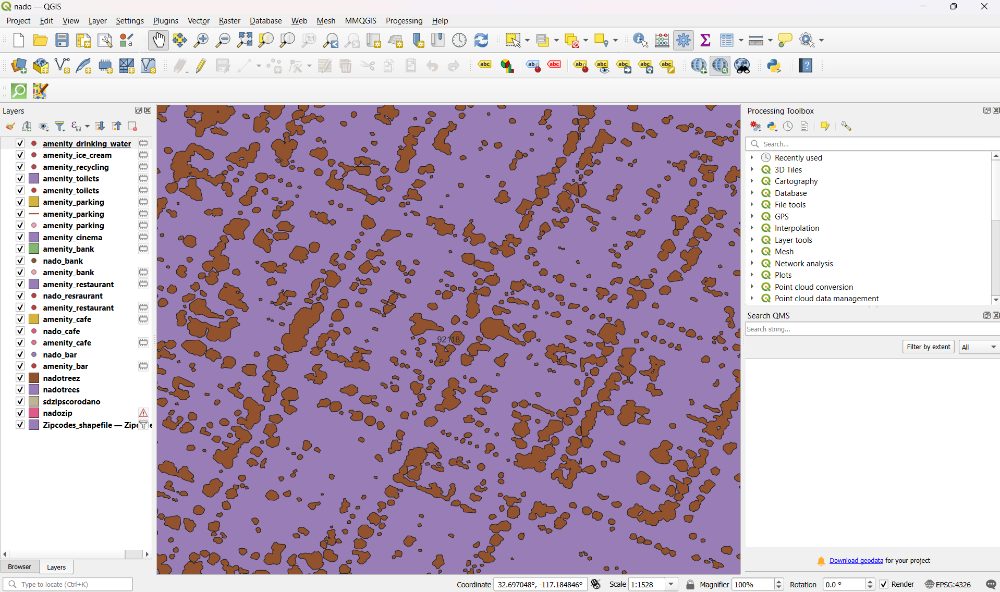

# geo_671_final_yum_yum_coronado
Sable's Final Map Project for Maps671

Tatile: A Trip to Coronado

Data info: I mainly used OSM to query for hotels, restaurants, banks, and other buisnesses I thought would be releventfor tourism. The zipcode layer came from SANDAG, a geographic data source for San Diego county. I attempted to get aggregated tree data but unfortunatley the majority of trees reside on private properites and the information about them is private. I was able to find a tree layer that was made through satalie, however I wanted to map different kind of trees, which the data was unavailable. 

Link to the data source: I used QuickOSM through QGIS for the most part. The other shapefiles come from this website.
https://geo.sandag.org/portal/apps/experiencebuilder/experience/?id=fad9e9c038c84f799b5378e4cc3ed068&page=Home 

I created this map because I wanted to continue working with Mapbox as the design features render much smoother. QGIS is fun but I can't make a map look as nice as easy there. I mapped Coronado as I use to live there for a few years. I wanted to map Orange Avenue and some of the major tourist hotspots. I tried hard to make the Hotel del Coronado 3d but I couldn't figure out how to eject that layer from the componets. I simply wanted to map some places that would be nice to visit for someone who had never been to Coronado.

Description about how the map was created: Data sourcing took the longest. Really this map is based around what Kind of data I found. SANDAG is a good resource for San Diego, but a lot of the data is almost 10 years old at this point. I tried to get Tree San Diego, a San Diego non profit who maps trees, to offer me data but they said they could not share any. So I resorted to acccumulating layers from QuickOMS. I wish I could have added more to MapBox but it maxxed out at 10 layers. Afterwards, i tried to play with the styles in order to make my map not look so default. 

Active link to the final index.html page:

Information about the projection of the original data and the projection for the final data: Because this was thorugh MapBox, I used EPSG 4326. However, data from SANDAG is given at the local EPSG 2230.